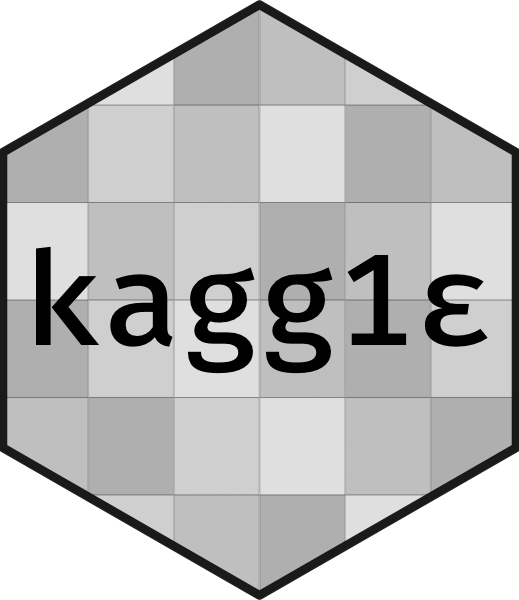

<!-- README.md is generated from README.Rmd. Please edit that file -->

```{r setup, include = FALSE}
knitr::opts_chunk$set(
  collapse = TRUE,
  comment = "#>",
  fig.path = "man/figures/README-",
  out.width = "100%", 
  cache = TRUE
)
library(kaggle)
options(width = 100)
options(tibble.print_min = 10)
options(tibble.print_max = 10)
```
# kaggle 

🏁 API client for [Kaggle](https://www.kaggle.com)

## Installation

You can install the dev version of kaggle from [CRAN](https://github.com/mkearney/kaggle) with:

``` r
## install kaggle package from github
devtools::install_packages("mkearney/kaggle")
```

## API authorization

1. Go to [https://www.kaggle.com/](kaggle.com) and sign in

1. Click `Account` or navigate to `https://www.kaggle.com/{username}/account`

1. Scroll down to the `API` section and click `Create New API Token` (which should cause you to download a `kaggle.json` file with your username and API key)

1. There are a few different ways to store your credentials

   + Save/move the `kaggle.json` file as `~/.kaggle/kaggle.json`
   + Save/move the `kaggle.json` file to your current working directory
   + Enter your `username` and `key` and use the `kaggle_auth()` function like in the example below

```{r, eval = FALSE}
kaggle_auth(username = "mkearney", key = "9as87f6faf9a8sfd76a9fsd89asdf6dsa9f8")
#> Your Kaggle key has been recorded for this session and saved as `KAGGLE_PAT` environment variable for future sessions.
```


## `kaggle_competitions_list_.*()`

Browse or search for Kaggle compeitions.

```{r complist}
## look through all competitions (paginated)
comps1 <- kaggle_competitions_list()
comps1 

## it's paginated, so to see page two:
comps2 <- kaggle_competitions_list(page = 2)
comps2

## search by keyword for competitions
imagecomps <- kaggle_competitions_list(search = "image")
imagecomps
```

## `kaggle_competitions_data_.*()`

Look up the datalist for a given Kaggle competition. **IF you've already accepted the competition rules, then you should be able to download the dataset too (I haven't gotten there yet to test it)**

```{r}
## data list for a given competition
c1_datalist <- kaggle_competitions_data_list(comps1$id[1])
c1_datalist

## download set sets (IF YOU HAVE ACCEPTED COMPETITION RULES)
c1_data <- kaggle_competitions_data_download(
  comps1$id[1], c1_datalist$name[1])
```

## `kaggle_datasets_.*()`

Get a list of all of the datasets.

```{r datalist}
## get competitions data list
datasets <- kaggle_datasets_list()
datasets
```


## `kaggle_competitions_leaderboard_.*()`

View the leaderboard for a given competition.

```{r leaderboard}
## get competitions data list
c1_leaderboard <- kaggle_competitions_leaderboard_view(comps1$id[1])
c1_leaderboard
```


## Note(s)

+ The author is in no way affiliated with Kaggle.com, and, as such, makes no 
assurances that there won't be breaking changes to the API at any time.

+ Although I am not affiliated, it's good practice to be informed, so here is 
the link to Kaggle's terms of service: https://www.kaggle.com/terms

