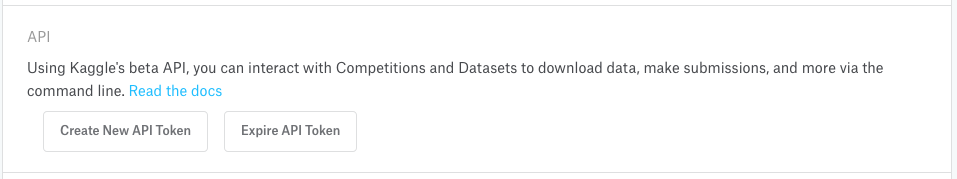

<!-- README.md is generated from README.Rmd. Please edit that file -->

# kaggle 

> 🏁 An R client for accessing [Kaggle](https://www.kaggle.com)’s API

## Installation

You can install the dev version of kaggle from
[CRAN](https://github.com/mkearney/kaggle) with:

``` r
## install kaggle package from github
devtools::install_packages("mkearney/kaggle")
```

## API authorization

<span>1.</span> Go to [https://www.kaggle.com/](kaggle.com) and sign in

<span>2.</span> Click `Account` or navigate to
`https://www.kaggle.com/{username}/account`

<span>3.</span> Scroll down to the `API` section and click `Create New
API Token` (which should cause you to download a `kaggle.json` file with
your username and API key)

<p style="align:center">



</p>

<span>4.</span> There are a few different ways to store your credentials

  - Save/move the `kaggle.json` file as `~/.kaggle/kaggle.json`
  - Save/move the `kaggle.json` file to your current working directory
  - Enter your `username` and `key` and use the `kaggle_auth()` function
    like in the example
below

<!-- end list -->

``` r
kaggle_auth(username = "mkearney", key = "9as87f6faf9a8sfd76a9fsd89asdf6dsa9f8")
#> Your Kaggle key has been recorded for this session and saved as `KAGGLE_PAT` environment variable for future sessions.
```

## `kaggle_competitions_list_.*()`

Browse or search for Kaggle compeitions.

``` r
## look through all competitions (paginated)
comps1 <- kaggle_competitions_list()
comps1 
#> # A tibble: 20 x 23
#>   ref    description      id title url    deadline category reward organizationName organizationRef
#> * <chr>  <chr>         <int> <chr> <chr>  <chr>    <chr>    <chr>  <chr>            <chr>          
#> 1 house… Predict sale…  5407 Hous… https… 2030-01… Getting… Knowl… Kaggle           kaggle         
#> 2 digit… Learn comput…  3004 Digi… https… 2030-01… Getting… Knowl… Kaggle           kaggle         
#> 3 titan… Start here! …  3136 Tita… https… 2030-01… Getting… Knowl… Kaggle           kaggle         
#> 4 image… Identify and…  6796 Imag… https… 2029-12… Research Knowl… ImageNet         image-net      
#> 5 image… Identify and…  6800 Imag… https… 2029-12… Research Knowl… ImageNet         image-net      
#> # ... with 15 more rows, and 13 more variables: kernelCount <int>, teamCount <int>,
#> #   userHasEntered <lgl>, userRank <lgl>, mergerDeadline <chr>, newEntrantDeadline <chr>,
#> #   enabledDate <chr>, maxDailySubmissions <int>, maxTeamSize <int>, evaluationMetric <chr>,
#> #   awardsPoints <lgl>, isKernelsSubmissionsOnly <lgl>, submissionsDisabled <lgl>

## it's paginated, so to see page two:
comps2 <- kaggle_competitions_list(page = 2)
comps2
#> # A tibble: 20 x 23
#>   ref    description      id title url    deadline category reward organizationName organizationRef
#> * <chr>  <chr>         <int> <chr> <chr>  <chr>    <chr>    <chr>  <chr>            <chr>          
#> 1 cvpr-… Can you segm…  8899 CVPR… https… 2018-06… Research $2,500 CVPR 2018 WAD    cvpr-wad       
#> 2 inatu… Long tailed …  8243 " iN… https… 2018-06… Research Kudos  <NA>             <NA>           
#> 3 imate… Image classi…  8219 iMat… https… 2018-05… Research $2,500 <NA>             <NA>           
#> 4 imate… Image Classi…  8220 iMat… https… 2018-05… Research $2,500 <NA>             <NA>           
#> 5 landm… Given an ima…  8396 Goog… https… 2018-05… Research $2,500 Google           google         
#> # ... with 15 more rows, and 13 more variables: kernelCount <int>, teamCount <int>,
#> #   userHasEntered <lgl>, userRank <lgl>, mergerDeadline <chr>, newEntrantDeadline <chr>,
#> #   enabledDate <chr>, maxDailySubmissions <int>, maxTeamSize <lgl>, evaluationMetric <chr>,
#> #   awardsPoints <lgl>, isKernelsSubmissionsOnly <lgl>, submissionsDisabled <lgl>

## search by keyword for competitions
imagecomps <- kaggle_competitions_list(search = "image")
imagecomps
#> # A tibble: 3 x 23
#>   ref    description      id title url    deadline category reward organizationName organizationRef
#> * <chr>  <chr>         <int> <chr> <chr>  <chr>    <chr>    <chr>  <chr>            <chr>          
#> 1 drape… "Can you put…  5229 Drap… https… 2016-06… Featured $75,0… <NA>             <NA>           
#> 2 carva… Automaticall…  6927 Carv… https… 2017-09… Featured $25,0… Carvana          carvana        
#> 3 cdisc… Categorize e…  7115 Cdis… https… 2017-12… Featured $35,0… Cdiscount        cdiscount      
#> # ... with 13 more variables: kernelCount <int>, teamCount <int>, userHasEntered <lgl>,
#> #   userRank <lgl>, mergerDeadline <chr>, newEntrantDeadline <chr>, enabledDate <chr>,
#> #   maxDailySubmissions <int>, maxTeamSize <int>, evaluationMetric <chr>, awardsPoints <lgl>,
#> #   isKernelsSubmissionsOnly <lgl>, submissionsDisabled <lgl>
```

## `kaggle_competitions_data_.*()`

Look up the datalist for a given Kaggle competition. **IF you’ve already
accepted the competition rules, then you should be able to download the
dataset too (I haven’t gotten there yet to test it)**

``` r
## data list for a given competition
c1_datalist <- kaggle_competitions_data_list(comps1$id[1])
c1_datalist
#> # A tibble: 7 x 6
#>   ref                  description name                 totalBytes url                creationDate 
#> * <chr>                <lgl>       <chr>                     <int> <chr>              <chr>        
#> 1 data_description.txt NA          data_description.txt      13370 https://www.kaggl… 2016-08-25T2…
#> 2 train.csv.gz         NA          train.csv.gz              91387 https://www.kaggl… 2016-08-29T2…
#> 3 train.csv            NA          train.csv                460676 https://www.kaggl… 2016-08-29T2…
#> 4 test.csv.gz          NA          test.csv.gz               83948 https://www.kaggl… 2016-08-29T2…
#> 5 test.csv             NA          test.csv                 451405 https://www.kaggl… 2016-08-29T2…
#> # ... with 2 more rows

## download set sets (IF YOU HAVE ACCEPTED COMPETITION RULES)
c1_data <- kaggle_competitions_data_download(
  comps1$id[1], c1_datalist$name[1])
#> Warning in kaggle_api_get(glue::glue("competitions/data/download/{id}/{fileName}")): Forbidden (HTTP
#> 403).
#> You must accept this competition's rules before you can continue
```

## `kaggle_datasets_.*()`

Get a list of all of the datasets.

``` r
## get competitions data list
datasets <- kaggle_datasets_list()
datasets
#> # A tibble: 20 x 20
#>   ref     creatorName  creatorUrl totalBytes url     lastUpdated downloadCount isPrivate isReviewed
#> * <chr>   <chr>        <chr>           <int> <chr>   <chr>               <int> <lgl>     <lgl>     
#> 1 passny… Chris Crawf… crawford       167711 https:… 2018-06-26…          2698 FALSE     TRUE      
#> 2 alxmam… Timo Bozsol… timoboz     235781000 https:… 2018-06-28…          2653 FALSE     TRUE      
#> 3 shruti… Shruti Mehta shrutimeh…    5732263 https:… 2018-03-13…          5791 FALSE     TRUE      
#> 4 heesoo… Randi H Gri… heesoo37      5690692 https:… 2018-06-15…           572 FALSE     TRUE      
#> 5 abeckl… Andre Beckl… abecklas       357590 https:… 2018-04-23…         11925 FALSE     TRUE      
#> # ... with 15 more rows, and 11 more variables: isFeatured <lgl>, licenseName <chr>,
#> #   description <chr>, ownerName <chr>, ownerRef <chr>, kernelCount <int>, title <chr>,
#> #   topicCount <int>, viewCount <int>, voteCount <int>, currentVersionNumber <int>
```

## `kaggle_competitions_leaderboard_.*()`

View the leaderboard for a given competition.

``` r
## get competitions data list
c1_leaderboard <- kaggle_competitions_leaderboard_view(comps1$id[1])
c1_leaderboard
#> # A tibble: 50 x 4
#>    teamId teamName           submissionDate               score  
#> *   <int> <chr>              <chr>                        <chr>  
#> 1 1780632 GroundTruth        2018-06-14T06:59:25.1433333Z 0.00000
#> 2  439244 DSXL               2018-05-26T15:30:35.25Z      0.06628
#> 3 1752010 chi7moveon         2018-06-05T01:28:52.66Z      0.10677
#> 4  365763 Paulo Pinto        2018-06-13T19:18:42.9966667Z 0.10910
#> 5 1363349 Dmitry Storozhenko 2018-06-12T04:34:11.0366667Z 0.10915
#> # ... with 45 more rows
```

## Note(s)

  - The author is in no way affiliated with Kaggle.com, and, as such,
    makes no assurances that there won’t be breaking changes to the API
    at any time.

  - Although I am not affiliated, it’s good practice to be informed, so
    here is the link to Kaggle’s terms of service:
    <https://www.kaggle.com/terms>
